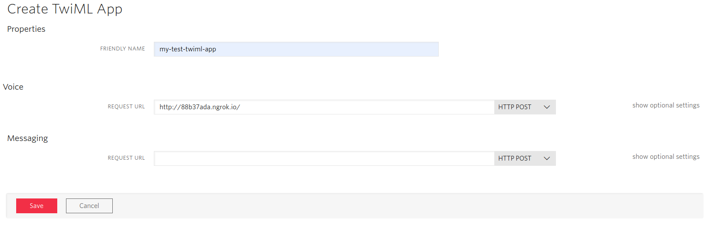
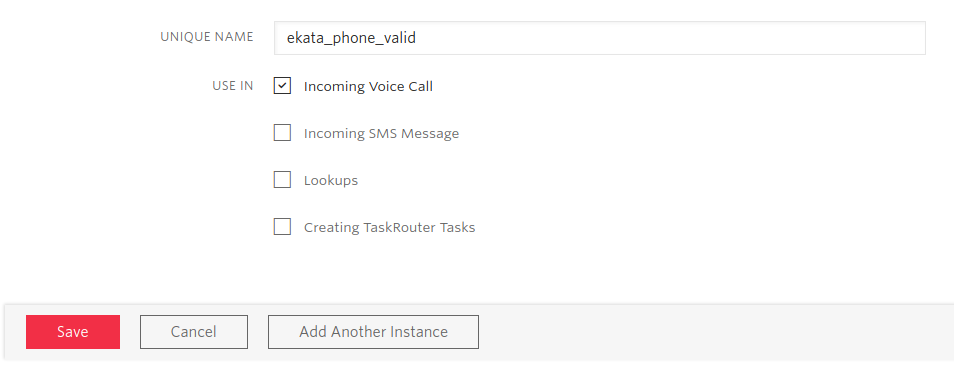
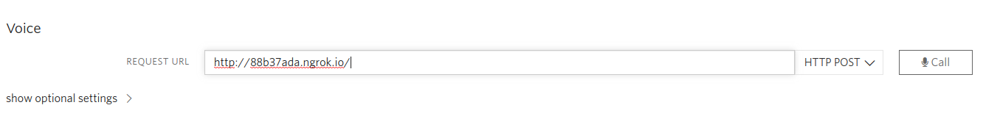

<a  href="https://www.twilio.com">

</a>

# Block Spam Calls. Powered by Twilio - C#/ASP.NET MVC


[](https://ci.appveyor.com/project/TwilioDevEd/block-spam-calls-csharp)

> We are currently in the process of updating this sample template. If you are encountering any issues with the sample, please open an issue at [github.com/twilio-labs/code-exchange/issues](https://github.com/twilio-labs/code-exchange/issues) and we'll try to help you.

## About

Learn how to use Twilio add-ons to block spam calls.

Follow the beginning of the [Block Spam Calls and RoboCalls guide](https://www.twilio.com/docs/voice/tutorials/block-spam-calls-and-robocalls-csharp) to learn how to add the spam filtering add-ons.

Implementations in other languages:

| Python | Java | Ruby | PHP | Node |
| :--- | :--- | :----- | :-- | :--- |
| [Done](https://github.com/TwilioDevEd/block-spam-calls-python) | [Done](https://github.com/TwilioDevEd/block-spam-calls-java)  | [Done](https://github.com/TwilioDevEd/block-spam-calls-ruby)  | [Done](https://github.com/TwilioDevEd/block-spam-calls-php) | [Done](https://github.com/TwilioDevEd/block-spam-calls-node)  |

<!--
### How it works

**TODO: Describe how it works**
-->

## Set up

### Requirements

- [.NET Framework](https://dotnet.microsoft.com/download/dotnet-framework/net472)
- A Twilio account - [sign up](https://www.twilio.com/try-twilio)
- [ngrok](https://ngrok.com)

### Create a TwiML App

This project is configured to use a **TwiML App**, which allows us to easily set the voice URLs for all Twilio phone numbers we purchase in this app.

To create a new TwiML app click [here](https://www.twilio.com/console/voice/twiml/apps).



### Install Add-ons

The following guide will help you to [install Add-ons](https://www.twilio.com/docs/add-ons/install). You can access the Add-ons in the Twilio console [here](https://www.twilio.com/console/add-ons). The Spam Filtering Add-ons that are used on this application are:
- [Ekata Phone Validation](https://showcase.twilio.com/s/partner-listing/a8E1W00000097QEUAY)
- [Marchex Clean Call](https://showcase.twilio.com/s/partner-listing/a8E1W00000097QxUAI)
- [Nomorobo Spam Score](https://showcase.twilio.com/s/partner-listing/a8E1W00000097R7UAI)

Once you've selected the Add-on, just click on `Install` button. Then, you will see a pop-up window where you should read and agree the terms, then, click the button `Agree & Install`. For this application, you just need to handle the incoming voice calls, so make sure the `Incoming Voice Call` box for `Use In` is checked and click `Save`



### Local development

After the above requirements have been met:

1. Clone this repository and `cd` into it

```bash
git clone git@github.com:TwilioDevEd/block-spam-calls-csharp.git
cd block-spam-calls-csharp
```

3. Build the solution

4. Run the application

5. To actually forward incoming calls, your development server will need to be publicly accessible. [We recommend using ngrok to solve this problem](https://www.twilio.com/blog/2015/09/6-awesome-reasons-to-use-ngrok-when-testing-webhooks.html)

```bash
ngrok http 8080 -host-header="localhost:8080"
```

Or, use [ngrok Extensions](https://marketplace.visualstudio.com/items?itemName=DavidProthero.NgrokExtensions) for Visual Studio. Select "Tools... Start ngrok Tunnel".

6. Once you have started ngrok, update your TwiML app's voice URL setting to use your ngrok hostname, so it will look something like this:

```shell
http://<your-ngrok-subdomain>.ngrok.io/voice
```

Finally, click on `Call` to test your application. See [Create a TwiML App](#create-a-twiml-app) to set the Voice URL.

  

That's it!

## Resources

- The CodeExchange repository can be found [here](https://github.com/twilio-labs/code-exchange/).

## Contributing

This template is open source and welcomes contributions. All contributions are subject to our [Code of Conduct](https://github.com/twilio-labs/.github/blob/master/CODE_OF_CONDUCT.md).

[Visit the project on GitHub](https://github.com/twilio-labs/sample-template-dotnet)

## License

[MIT](http://www.opensource.org/licenses/mit-license.html)

## Disclaimer

No warranty expressed or implied. Software is as is.

[twilio]: https://www.twilio.com
